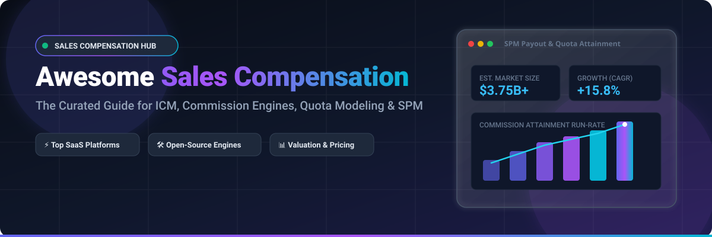
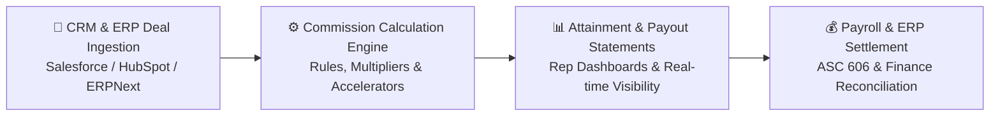

  

# 💰 Awesome Sales Compensation

  
  
  
  
  
  
  
  

---

## 🎯 Overview & Ecosystem Guide

A curated, comprehensive index of **SaaS Platforms**, **Open-Source Calculation Engines**, **Simulators**, and **RevOps Tools** dedicated to **Sales Compensation**, **Incentive Compensation Management (ICM)**, **Commission Calculation**, **Quota Planning**, and **Sales Performance Management (SPM)**.

These systems design, calculate, simulate, and administer sales commissions, bonuses, accelerators, SPIFs, and variable incentive plans with precision, auditability, and ASC 606 / IFRS 15 compliance.

---

## 📑 Table of Contents

- [📊 Market Overview & Industry Dynamics](#-market-overview--industry-dynamics)
- [🏢 SaaS / Hosted SPM Platforms](#-saashosted-spm-platforms)
- [🛠️ Open-Source GitHub Projects](#️-open-source-github-projects)
- [🏗️ Implementation & Architecture Framework](#️-implementation--architecture-framework)
- [🤝 How to Contribute](#-how-to-contribute)
- [📈 Star History](#-star-history)
- [⚠️ Disclaimer](#️-disclaimer)

---

## 📊 Market Overview & Industry Dynamics

> 📊 **Market Size & Industry Dynamics:** The global **Incentive Compensation Management (ICM)** and **Sales Performance Management (SPM)** sector is valued at **$3.2B – $3.75B (2025/2026)** and projected to expand at a **14% – 17% CAGR** to reach **$10B – $12.2B by 2034**. The sector is **moderately fragmented** (medium market concentration with the top 5–10 vendors capturing ~45%–60% market share). While legacy enterprise suites (Salesforce/Spiff, Anaplan, Varicent) lead deep global implementations, modern AI-native and no-code challengers (CaptivateIQ, Everstage, QuotaPath) are rapidly capturing market share through self-service modeling, transparent pricing, and rapid CRM integrations.

---

## 🏢 SaaS / Hosted SPM Platforms

The table below is sorted by **Company Size (Valuation / Revenue) descending**:

| 🏢 Product | 📈 Company Size (Valuation / Revenue) | 📝 Description | 💵 Pricing (Starting / Base Tier) | 🎁 Free Tier / Trial Limits |
| :--- | :--- | :--- | :--- | :--- |
| **[Spiff (Salesforce)](https://www.salesforce.com/products/spm/)** | **~$248B Market Cap** ($41.5B Rev; acquired for $419M) | Native Salesforce commission and incentive solution providing real-time rep visibility, automated payout calculations, and tight Sales Cloud integration. | **$75/user/month** base license (Salesforce ICM, billed annually); optional external non-Salesforce connectors at **$250/connector/month** | **No self-service free trial** (Salesforce provides customized product sandbox walkthroughs and live demos on request) |
| **[Anaplan Incentive Compensation / SPM](https://www.anaplan.com/)** | **$10.7B Valuation** (Acquired by Thoma Bravo; ~$592M ARR) | Connected enterprise planning platform linking incentive compensation with broader finance, territory planning, quota modeling, and sales capacity processes. | Starts at **~$30,000–$50,000/year** for entry-level deployments (median contract ~$100,000/year; tiered by Model Builder, Contributor, and Viewer seats) | **No commercial free trial** (offers a **90-day free trial workspace** strictly for individual learners/certifications via the Anaplan Talent Builder program) |
| **[CaptivateIQ](https://www.captivateiq.com/)** | **$1.3B Valuation** (Series C; ~$55.5M ARR) | Modern no-code / spreadsheet-style incentive compensation platform with flexible plan design, robust calculation engine, and connected planning capabilities. | Starts at **~$55–$60/user/month** (annual contracts; typical entry contract baseline ~$12,000–$15,000/year based on payee count) | **No self-service free trial** (free interactive self-guided tour available on website; custom proof-of-concept modeled during sales demo) |
| **[Varicent](https://www.varicent.com/)** | **~$1.0B+ Valuation** (~$150M+ ARR; Great Hill & Spectrum backed) | Enterprise SPM and incentive compensation solution known for handling extreme plan complexity, revenue intelligence, territory management, and advanced analytics. | Starts at **~$56–$70/user/month** (annual enterprise commitments typically start at ~$30,000–$50,000/year based on payees) | **No self-service free trial** (enterprise evaluation via personalized demo environments and structured POCs) |
| **[Xactly](https://www.xactlycorp.com/)** | **$564M Valuation** (Acquired by Vista Equity; ~$150M+ ARR) | Enterprise sales performance management suite with mature commission calculation (Incent), benchmarking, territory alignment, and pipeline forecasting features. | Starts at **~$60/user/month** (~$720/user/year; base entry deployments start at ~$20,000+/year depending on modules) | **No self-service free trial** (offers scheduled custom product demonstrations and workflow scoping sessions) |
| **[Everstage](https://www.everstage.com/)** | **~$120M–$150M Valuation** ($45M funding; ~$10M–$15M ARR) | AI-assisted sales compensation platform focused on fast plan modeling, accurate calculations, audit trails, and rep-facing transparent payout statements. | Starts at **~$40–$50/payee/month** (typical entry annual contracts start at ~$30,000/year; median ACV ~$41,140/year) | **No self-service free trial** (provides a free custom Proof of Concept modeling actual compensation plans prior to contract signing) |
| **[Performio](https://www.performio.co/)** | **~$100M+ Valuation** ($75M investment by JMI Equity; ~$17.9M ARR) | Sales compensation and performance management platform featuring plan templates, component-based design, auditability, and native CRM connectivity. | Starts at **~$50/user/month** (billed annually; entry-level annual contracts typically start at ~$30,000/year + implementation) | **No self-service free trial** (offers guided product evaluation and custom live demo sessions upon request) |
| **[QuotaPath](https://www.quotapath.com/)** | **~$70M–$100M Valuation** ($39M funding; ~$4.1M ARR) | Accessible commission tracking and plan management platform popular with growing SMB and mid-market teams; transparent pricing and CRM integrations. | Starts at **$525/month platform fee** (billed annually, includes first 5 users) + **$35/user/month** for additional users on Growth tier (**$50/user/month** on Premium) | **14-day free trial** with full access to plan building, CRM integrations, and tracking; permanent free Comp Plan Builder tool on website |
| **[Iconixx](https://www.iconixx.com/)** | **~$20M–$30M Valuation** (Growth Stage; ~$5M–$10M ARR) | Incentive compensation and sales performance management platform focused on complex variable compensation plan administration and workflow automation. | Starts at **$8,500/year** (base contract tier for core plan administration; scales by payee count and complexity) | **No standard self-service free trial** (offers interactive personalized demos; promotional 1-month trial credit occasionally available upon sign-up) |
| **[SalesCookie](https://www.salescookie.com/)** | **~$5M Valuation** (Bootstrapped / Profitable; ~$600K ARR) | Commission tracking and sales compensation tool aimed at transparency, automated data syncing, and simpler plan administration for SMBs. | **$40/user/month** for Business Plan (billed monthly/annually per active payee) | **14-day free trial** (no credit card required, full Business features; limits: up to 100k transactions, 25 plans, 1k calculations) |

---

## 🛠️ Open-Source GitHub Projects

The list below features open-source repositories, calculation engines, and tools sorted by **GitHub_Stars descending**:

- **[jlevy/og-equity-compensation](https://github.com/jlevy/og-equity-compensation)**   
  *Comprehensive open guide to equity compensation, stock options, RSUs, variable incentives, and tax structuring for startups and enterprises.* 🌟

- **[OCA Commission (Odoo)](https://github.com/OCA/commission)**   
  *Leading open-source commission management modules for Odoo ERP — handles sales agent commissions, tiered formulas, product criteria, and accounting entries.* 📦

- **[dvdl16/erpnext_sales_commission_details](https://github.com/dvdl16/erpnext_sales_commission_details)**   
  *Detailed reporting and calculation module showing partner & sales rep commissions per invoice, grouped by customer for ERPNext.* 📑

- **[avinashvaidya09/sales-commission](https://github.com/avinashvaidya09/sales-commission)**   
  *Full-stack sales commission calculation application for managing rep incentive structures and tracking monthly payouts.* 💻

- **[ayangzy/laravel-sales-commission](https://github.com/ayangzy/laravel-sales-commission)**   
  *A comprehensive sales commission calculation and management engine package for Laravel web applications.* ⚙️

- **[Azeemaj101/Sales-Commission-Calculator](https://github.com/Azeemaj101/Sales-Commission-Calculator)**   
  *Calculation tool implementing multi-tier gross commission algorithms and variable compensation rules.* 🧮

- **[jadamduff/commission-tracker](https://github.com/jadamduff/commission-tracker)**   
  *App allowing sales managers and employees to register deals, configure margin targets, and track sales commission payouts.* 📱

- **[TheWorkflowAcademy/Sales-commissions-dashboard](https://github.com/TheWorkflowAcademy/Sales-commissions-dashboard)**   
  *Real-time analytics dashboard template to track salesperson commissions in Zoho Analytics connected with Zoho Books / Zoho CRM.* 📊

- **[Illvzixn/Commission-Analytics-PowerBi-Project](https://github.com/Illvzixn/Commission-Analytics-PowerBi-Project)**   
  *Power BI dashboard tracking quota attainment, commission payouts, accelerator multipliers, and regional sales effectiveness.* 📉

- **[jjeanius/rails_project_sales_commission_application](https://github.com/jjeanius/rails_project_sales_commission_application)**   
  *Ruby on Rails system for retail market sales commission management, payout schedules, and salesperson dashboards.* 💎

- **[renanbernardelli/Sales-Commission-Calculation](https://github.com/renanbernardelli/Sales-Commission-Calculation)**   
  *JavaScript and HTML tool for interactive sales commission rules, bracket simulation, and percentage adjustments.* 🌐

- **[ManiruzzamanAkash/commission-calculator](https://github.com/ManiruzzamanAkash/commission-calculator)**   
  *Clean PHP commission calculation engine with unit tests and transaction CSV ingestion.* 🐘

- **[humanytek-team/sales_commission_product_subcategory](https://github.com/humanytek-team/sales_commission_product_subcategory)**   
  *Odoo addon for automatic tiered commission calculation categorized by product lines and subcategories.* 🏷️

- **[codeback/openerp-sale_commission](https://github.com/codeback/openerp-sale_commission)**   
  *OpenERP / Odoo extension for managing sales agent commissions and payout settlement.* 🔧

- **[andreacometa/salesagent_commissions](https://github.com/andreacometa/salesagent_commissions)**   
  *Sales agent commission calculation and settlement tracking module for open ERPs.* 🤝

- **[hamaswa/SCS](https://github.com/hamaswa/SCS)**   
  *Sales Commission System backend application for managing sales rep commission allocations.* 🖥️

- **[MikeMordec/SalesCommissionCalculator-](https://github.com/MikeMordec/SalesCommissionCalculator-)**   
  *Python tool for calculating commissions, gross income, and variable pay for salespeople based on sales data.* 🐍

- **[RCushmaniii/comp-plan-simulator](https://github.com/RCushmaniii/comp-plan-simulator)**   
  *Interactive open tool for modeling commission structures, overrides, and financial impact before rolling out plan changes.* 🧪

---

## 🏗️ Implementation & Architecture Framework

### 🔑 Key Strategies for RevOps Teams:
- **ERP Integration:** Deploy **Odoo + OCA Commission** or **ERPNext** modules when running open ERPs to avoid recurring third-party SaaS seat licenses.
- **Pre-Rollout Modeling:** Build scenario simulators to forecast payout liabilities and "what-if" models before finalizing fiscal-year compensation plans.
- **Clean Deal Pipelines:** Ensure CRM closed-won stage gates trigger automated data validation to minimize commission clawbacks and payout disputes.
- **Enterprise Scale:** Commercial platforms remain the industry standard for multi-currency handling, ASC 606 amortization compliance, dispute workflows, and complex team overrides.

---

## 🤝 How to Contribute

1. 🍴 **Fork** the repository on GitHub.
2. 🌿 **Create a Branch** for your feature or update (`git checkout -b add-new-comp-tool`).
3. 📝 **Add/Update entries** in `README.md` keeping descriptions factual, concise, and linked to official sites.
4. 🚀 **Submit a PR** with a brief summary of the addition or update.

⭐ **Star the repo** if you find this sales compensation guide helpful!

---

## 📈 Star History

---

## ⚠️ Disclaimer

- This is a **community-curated index** — not financial, legal, tax, or HR advice.
- Sales compensation plans involve binding employment contracts and legal obligations. Calculation discrepancies can impact rep trust, employee retention, and audit compliance. Always validate plan logic with finance, RevOps, and legal teams before rolling out new incentive models.

---

  <b>Built for RevOps, Sales Operations, and Finance teams building accurate, transparent, and scalable compensation plans. 🚀</b>

